# ShoppingPal

## CA326 Functional Specification

Ben Kelly & Kyrylo Khaletskyy

## Table of Contents
- [1 Introduction](#1-introduction)
  * [1.1 Overview](#11-overview)
  * [1.2 Business Context](#12-business-context)
  * [1.3 Glossary](#13-glossary)
- [2. General Description](#2-general-description)
  * [2.1 Product/System Functions](#21-product---system-functions)
  * [2.2 User Characteristics and Objectives](#22-user-characteristics-and-objectives)
  * [2.3 Operational Scenarios](#23-operational-scenarios)
  * [2.4 Constraints](#24-constraints)
- [3. Functional Requirements](#3-functional-requirements)
  * [3.1 Login/Registration](#31-login---registration)
  * [3.2 Profile Selection](#32-profile-selection)
  * [3.3 Profile Creation](#33-profile-creation)
  * [3.4 Barcode Functionality](#34-barcode-functionality)
  * [3.5 Product Retrieval & Assessment](#35-product-retrieval-&-assessment)
- [4. System Architecture](#4-system-architecture)
- [5. High-Level Design](#5-high-level-design)
  * [5.1 Context Diagram](#51-context-diagram)
  * [5.2 Process Diagram](#52-process-diagram)
  * [5.3 Use Case Diagram](#53-use-case-diagram)
  * [5.4 Use Case Descriptions](#54-use-case-descriptions)
- [6. Preliminary Schedule](#6-preliminary-schedule)
- [7. Appendices](#7-appendices)

##  1 Introduction

###  1.1 Overview

ShoppingPal is an Android application which helps users with restrictions to buy groceries safely from a local store. Whether the user has allergies or intolerances to certain
ingredients found in food items, pharmaceutical products or toiletries. ShoppingPal also aims to help athletes with strict dietary and pharmaceutical restrictions buy items
in a store without the worry of failing a drug test. Users will register with an email and password and proceed to set up their profile. A user's profile contains his/her
restrictions at a given time. The app will provide a user with a wide variety of common food allergens, as well as an accurate approved WADA (World Anti Doping Agency)
specified banned substances taken directly from a list provided by WADA. Users who have specific allergies or restrictions not found in the common list provided have
the option to set up their own profiles containing ingredients manually selected/inputted by the user. Upon successful registry and profile set up, the user will be given the 
option to proceed to scan a barcode. Once the barcode is scanned it will fetch that particular item in the dataset and compare the list of ingredients found in that particular 
item to the list of ingredients found in the user's profile. The app will tell the user if they can buy this particular product and give the list of ingredients in the product 
as well as the ingredients that match the user's profile if the item contains restricted ingredients.

User registration details and user's personal profiles will be stored on an external database, as a result of this we can learn from a user's input once enough people
sign up and begin using the app we can see which restrictions are common amongst the population, which profiles are widely used and from that we can evaluate the data
and integrate these profiles into our app.

###  1.2 Business Context

ShoppingPal is mostly aimed at people with allergies, intolerances and general restrictions but can be used by any user who wishes to avoid certain ingredients from their 
diet/use as well as people who have trouble reading labels in a store. It is estimated by the WAO (World Allergy Organisation) that allergy prevalence of the whole population 
by country ranges between 10-40% which in Ireland would total to at least 500,000 people. It is difficult to estimate the number of professional athletes in the world but 
according to WADA there have been 303,369 samples of drugs tests taken in 2015. ShoppingPal can therefore be used by a very large group of people.

###  1.3 Glossary

- **WADA**

      World Anti Doping Agency

- **WAO**

      World Allergy Organisation

- **XML**

      Extensible Markup Language

- **API**

      Application Programming Interface

- **EAN-13**

      A type of barcode used by many stores.

- **ZXing**

      A library used to scan a barcode and retrieve the corresponding numbers displayed under the barcode of an item.

##  2. General Description

###  2.1 Product / System Functions

##### User Registration

In order for a user to use this application, he/she must download and install ShoppingPal. Upon successful installation, a user will be asked to enter an email (which will 
be used as a username) and password. When a user updates their mobile phone, their app data will be saved on an external database, therefore a user can simply sign in on another
device and continue using ShoppingPal as normal.

##### User Login

A user will login in with a unique email and password which they have created earlier, once a user is logged into the app he/she does not need to log in again until they have
logged out or changed/reset their device. The login details will be compared to the ones already stored in the database. If they don't exist a user will be prompted to create
an account.

##### Profile Selection

Upon initial entry into the app a user will be provided with a list of "The 14" major allergens taken directly from a reliable source, as well as WADA banned substances also
taken directly from their website to reduce any human error. These set of profiles will be a great starting point for most users. A user can select the profile they intend 
on using and continue to scan a barcode of an item with that particular profile selected.

##### Profile Creation

Any user who doesn't find a profile which they need can create their own profile. A profile consists of a name chosen by the user, and a list of ingredients which the user
intends to avoid from their use. After successful creation the user is brought back to their homepage where he/she can now see a new profile that they created among the list
of profiles which are already contained within the application.

##### Scanning a Barcode

A logged in user will be taken to the homescreen where he/she will a see a list of profiles including the ones they have previously made. The last profile that the user has 
used will be selected and now he/she can continue by pressing the scan button. When a user presses the scan button the app will open the rear camera of the mobile device and 
present the user with a horizontal line across the screen where the user should aim to point the barcode at. When a user successfully scans an items barcode he/she will be 
presented with the product data and information page.

##### Viewing Product Data

Upon successful scan of a barcode the application will compare the user's profile to the ingredients of the item that was scanned and tell the user if it is safe to buy the
item in question, as well as give the list of ingredients found in the item, and a list of ingredients that match the comparison so that the user can see what was found in the
item scanned. The user is then given the option to go back to the homescreen where he/she can scan another item.

##### Removing an Account

We recognise that a user's needs may change in the future, therefore every user has the option to delete their account.

###  2.2 User Characteristics and Objectives

As stated previously, ShoppingPal is primarily aimed at people with all kinds of dietary and/or additive restrictions. As this characteristic applied to people all ages it is
safe to assume that this application will be used by anybody with an Android phone with a camera. We aim the app to be easy to use for a person with any technical ability,
people who belong to both the younger and older generation. We intend to create a user interface which can be navigated quickly and intuitively, there should be a minimal 
learning curve to using this application. As this application is targeted to be used while in a store, we aim the application to be as minimalistic as possible to allow the 
user to see only what he/she requires, which is whether they can buy/consume the product or not. It is also important to take into account that the older generation would have 
trouble reading labels and this application would be perfect for that category of people, therefore we must ensure that all text and buttons are clearly labelled, readable 
and proportionately sized to be accessible for people with poor eyesight.

###  2.3 Operational Scenarios

##### User login & Registration

The user downloads the application from the PlayStore and installs the application. He/she then creates an account with their email & password. Invalid or incomplete login 
details will be notified to the user using Android on-screen notifications. Once a user successfully registers he/she is taken to the login page. Upon successful login 
he/she is met with the homescreen of the application. Incorrect or incomplete login details will also be notified to the user.

##### Users Homescreen

Once logged in a user sees their Homescreen, which contains a Profile Selection, Profile Creation and Scan Button. From here they can create new profiles and select existing
ones. Once a user selects a profile he/she can continue to scan an item.

##### User wishes to Create Profile

When a user does not find a Profile he/she requires they press the "Create Profile" button which brings them to a new page where they input a name and a list of ingredients
they wish to restrict, if either name or list is incomplete the user will be notified to change the details. Once a user finishes creating their profile they are returned
back to the homescreen and they are given a confirmation that their profile has been created successfully.

##### User Presses the Scan Button

When a user presses the scan button the rear camera turns on, if a profile has not been selected the system will prompt the user to select a profile. The user is met with a 
display of what the rear camera on their mobile device sees with a red line in the centre where the barcode is expected. Upon successful scan of a barcode the red line will 
turn green. If a particular product is not supported or the barcode is not found the user will be notified that the product does not exist or that the barcode is invalid. 
A successful scan will bring the user to the product data along with details whether it is safe to consume/buy the product.

##### User Returns to Homescreen

After the user is finished with the information about the product the user will press "Return Home" where it takes them back to the homescreen. At this point the user can 
choose to scan another barcode, select another profile or create a new profile. From here the user also has the option to log out of the application.

##### User wishes to Delete Account

When a user decides to Delete their account he/she can do so by entering the account settings screen. This will be accessible from the homescreen provided the user has an
existing account and is logged in.

**Additional Use Case Descriptions can be found at 5.4**

### 2.4 Constraints

##### Hardware Constraints

As this is an Android application, for the duration of this project we focus on making this application to work as efficient and satisfactory as possible on an Android device.
Code for this project will mostly be written on Android Studio on a Windows machine.

##### User Constraints

We must first and foremost comply with ease of use. We want the app to be quick, simple and user friendly. Therefore we must understand what the chosen demographic, and know
their needs and motives to use this application.

##### Time Constraints

As this is a 3rd year project, this application must be completed by the 5pm Friday 9th of March 2018. We aim to complete the application and all supporting documentation by
that date as well as add extra functionality if the time allows us to do so.

##### Technical Constraints

Our application relies heavily on the datasets provided to us by the Manufacturers and Wholesalers of the goods in question. We must therefore find as many datasets as possible
to give us a large set products which could be scanned and searched.

##### Security Constraints

We will be using an external database to store all user data such as emails, passwords and profiles. We must therefore respect a user's privacy and must take the security of 
this data into consideration.

## 3. Functional Requirements

### 3.1 Login/Registration

-   **Description:**

      In order to use this application, the user must login and register. A database is needed to store this information, a user will be given the option to register when
      he/she first installs the application. Once registered a user can then log in on any device.

-   **Criticality:**

      As registration is critical to the use of this application, it is important for this function to work correctly and make sure that each user is given a unique ID to store
      their details and profiles.

-   **Technical issues:**

      It is essential that all login details are securely added to the database, also it is important that they are added correctly so that there are no mismatches between
      multiple users. User profiles must only map to their own accounts.

-   **Dependencies:**

      Without a correct Login/Registration a user will not be able to operate this application past the login page. All other functionality will not be available to the user.

### 3.2 Profile Selection

-   **Description:**

      Once a user successfully logs in, he/she will be presented with the homescreen which contains a selection of profiles to choose from. These premade profiles contain
      a list of ingredients which are restricted to the profile in question. When a user selects a profile he/she can continue to scan an item they wish to review.

-   **Criticality:**

      Choosing a profile is critical to the operation of this application. It is important that premade profiles provided by the system are imported correctly to allow
      the comparison to run between the selected ingredients in the profile and the ingredients in the item scanned. The ingredients must also have the correct format,
      capitalization and spelling.

-   **Technical issues:**

      The issue is to find a reliable source of restricted ingredients to be mapped to the correct profile, WADA for sports related restrictions, and a reliable food health
      source for allergen information. Another issue is to make that that every item on the list must be of correct format as stated previously.

-   **Dependencies:**

      Profiles heavily depend on the ingredients to be imported correctly. Without a profile selected a comparison between the item ingredients and the ingredients found 
      in the profile cannot be performed by the system.

### 3.3 Profile Creation

-   **Description:**

      A user who does not find a profile he/she requires can create a personal profile. A profile is made up of a name and a list of ingredients selected by the user. This 
      profile will be mapped to the particular user and stored on an external database. This allows a user to retain the profiles that they have when moving to another device.
      A profile consists of a name, and a list of ingredients which the user can search and select from a list predefined by the system, this reduces users making spelling
      mistakes on common items, if a user doesn't find an item predefined in the list he/she can add their own.
      
-   **Criticality:**

      As with Profile Selection above it is crucial to the operation of the application to choose a profile. When a user chooses a profile which he/she created the system
      works in the same way as before where it compares to the ingredients listed in the profile to the ingredients found in the item scanned.

-   **Technical issues:**

      It is important that the user inputs the ingredients they wish to restrict correctly, we must create an input that converts the input into the correct format which
      can also be compared by the system. It is also vital that these ingredients are properly stored in the database and later retrieved from the database. When an item
      is not contained in the list of ingredients provided, the user has the option to continue to type an ingredient in.

-   **Dependencies:**

      This functionality heavily depends on the correct addition of new profiles and their ingredients into the database. Before adding a particular ingredient into the
      database it must be formatted according to our specification.

### 3.4 Barcode Functionality

-   **Description:**

      To retrieve product data, the camera is used to read the barcode of an item. This functionality essentially uses the ZXing library to read a barcode and return the
      numbers which correspond underneath it. These numbers are then used to search a product and its related data.

-   **Criticality:**

      It is critical that a phone has a camera and the user points the camera at the barcode, while holding the item steady to reduce failure.

-   **Technical issues:**

      We must implement this library correctly so that the numbers passed through to the product data search are correct and comply with the EAN-13 barcode specification.

-   **Dependencies:**

      The Barcode Functionality heavily relies on the ZXing library. Without a barcode on an item, it cannot be scanned and its information cannot be retrieved. But,
      fortunately every item in a store contains a barcode with exception to non packaged fruit and vegetables.

### 3.5 Product Retrieval & Assessment

-   **Description:**

      After a user successfully scans an item, he/she is presented with the product information as well as information on whether it is safe for the user to buy/consume the
      product. The system will compare the ingredients selected in the profile by the user and the ingredients of the item retrieved from the dataset provided by the
      wholesaler or manufacturer.

-   **Criticality:**

      It is crucial that, the graphical interface that displays this information can be easily readable and a user is given a list of items which are found to give them
      reassurance. Just as important is the barcode number passed through by the Barcode Functionality, the correct item must be collected from the dataset, a user will be given
      the name and barcode number in the output also, letting them know the name of the product they he/she scanned.

-   **Technical issues:**

      It is important that the ingredients in the profile and the ingredients retrieved from the dataset are the same format as "Tomato" and "tomato" will not come through
      as a match by the system.

-   **Dependencies:**

      As this is the last step of the system, it relies on the Barcode Functionality, Profile Selection, and item information retrieval.
      

## 4. System Architecture
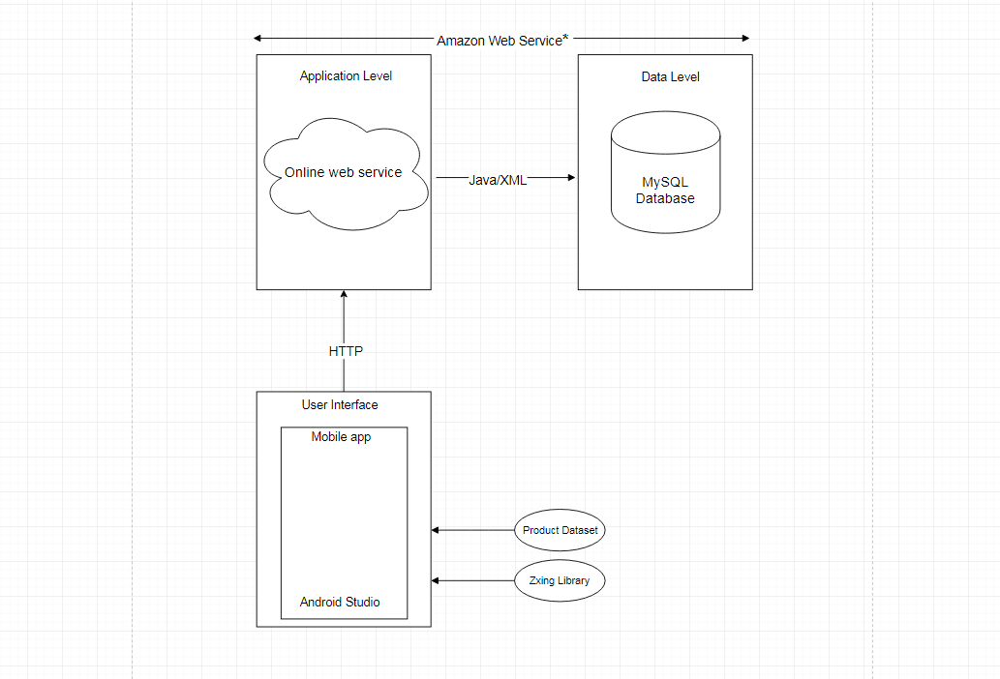

*Amazon web services will most likely be our online service of choice but we are still in the process of learning how to implement it. In essence, we might use a different 
service instead of AWS to link our database online. This is why the asterisk is present.

This system architecture diagram is to make the structures around our app easier to understand. It is the conceptual model that defines the structure, behaviour, and general 
view of the system.

## 5. High-Level Design

### 5.1 Context Diagram

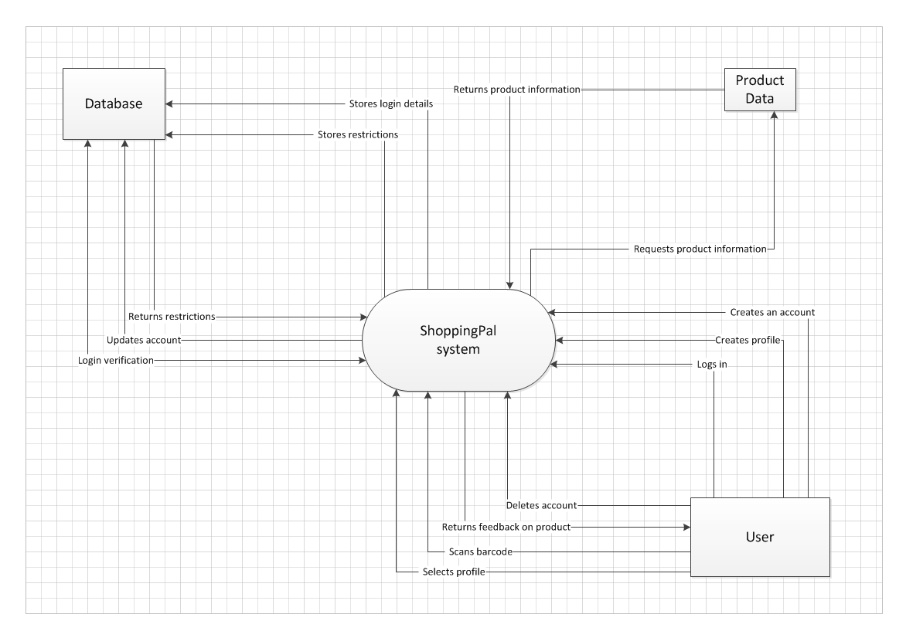
The context diagram gives us a great volume of detail in terms of the system (app) itself and the entities it interacts with. For example the system only interacts with the 
product data when it asks for information about a particular product specified by the user scanning a unique barcode. In contrast to this the user can interact with the system 
in a multitude of ways as seen above.

### 5.2 Process Diagram

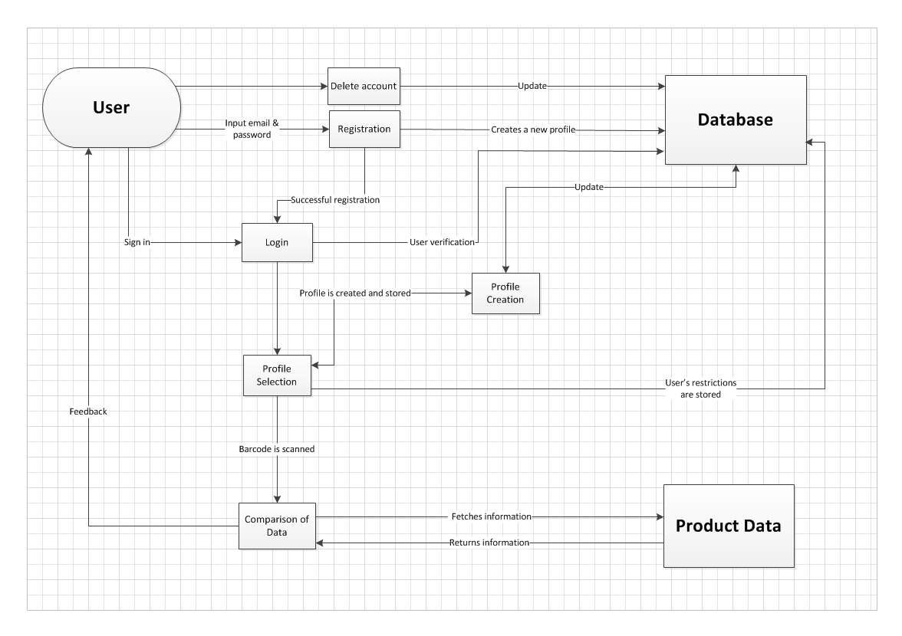

The process diagram above is a graphical representation of the movement of data through our system. It essentially shows how each process works at step by step intervals. For 
instance, a user cannot directly interact with the Database or our product data but through the app in various ways the User’s details can be changed to reflect an apparent 
change to each respective process.

### 5.3 Use Case Diagram

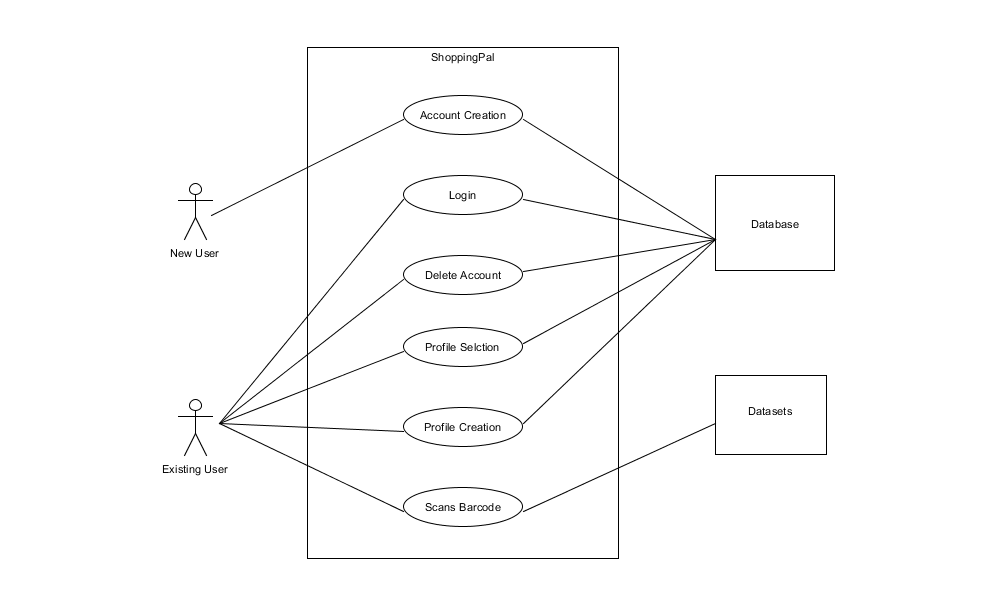

### 5.4 Use Case Descriptions

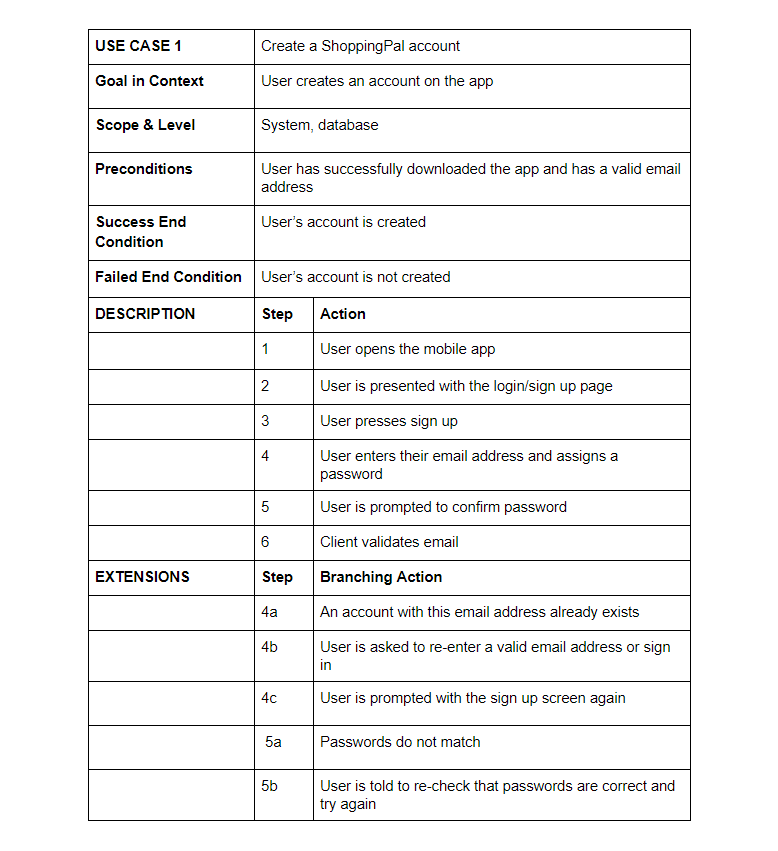
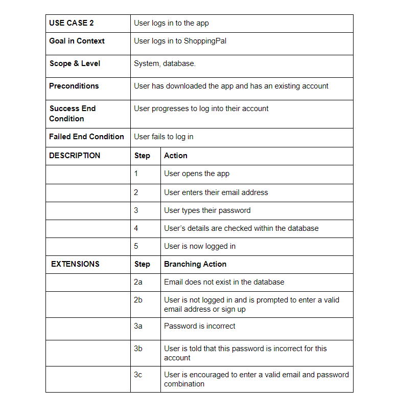
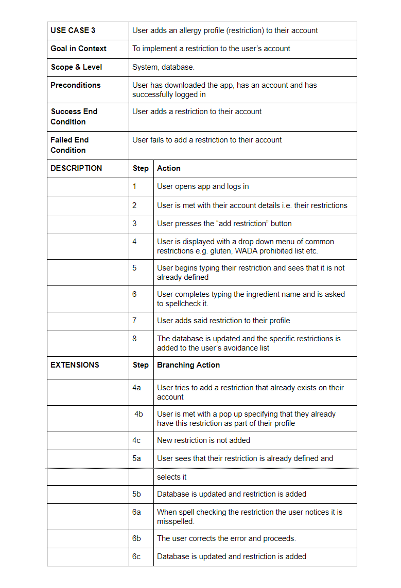
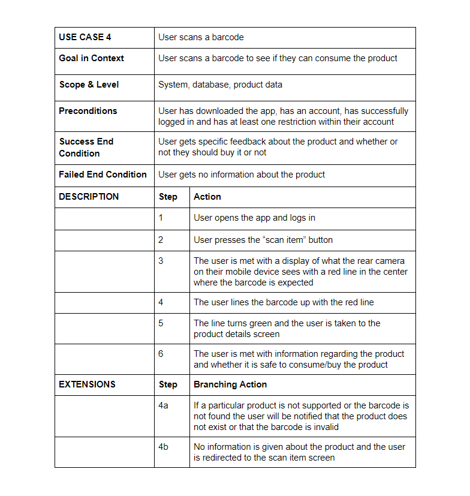
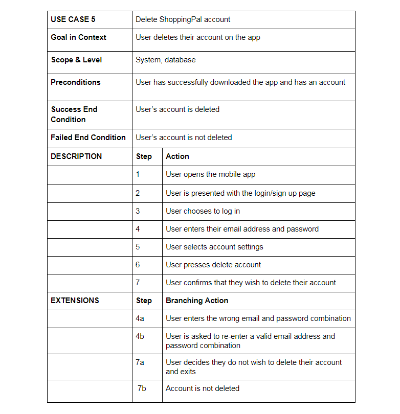

## 6. Preliminary Schedule

### Gantt Chart

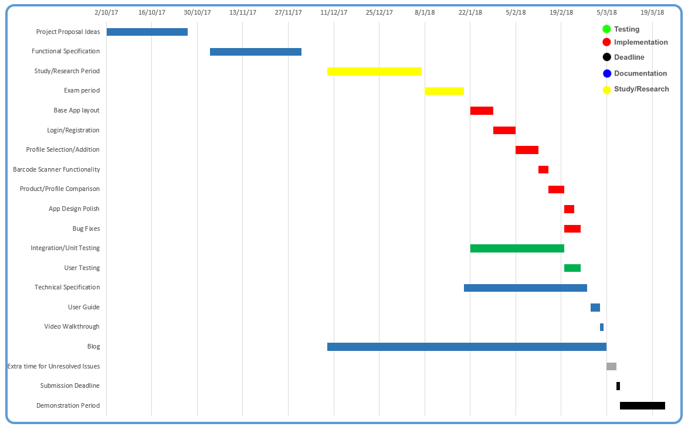

### Timetable

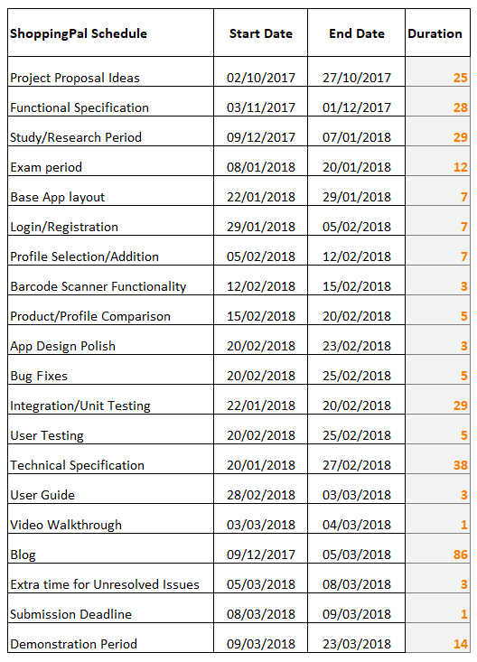

## 7. Appendices

##### ZXing Library:
https://zxingnet.codeplex.com

##### Erudus Dataset (product data):
https://erudus.com

##### TescoLabs Dataset (product data):
https://devportal.tescolabs.com/

##### WADA:
https://www.wada-ama.org/en

##### Amazon Web Services
https://aws.amazon.com/